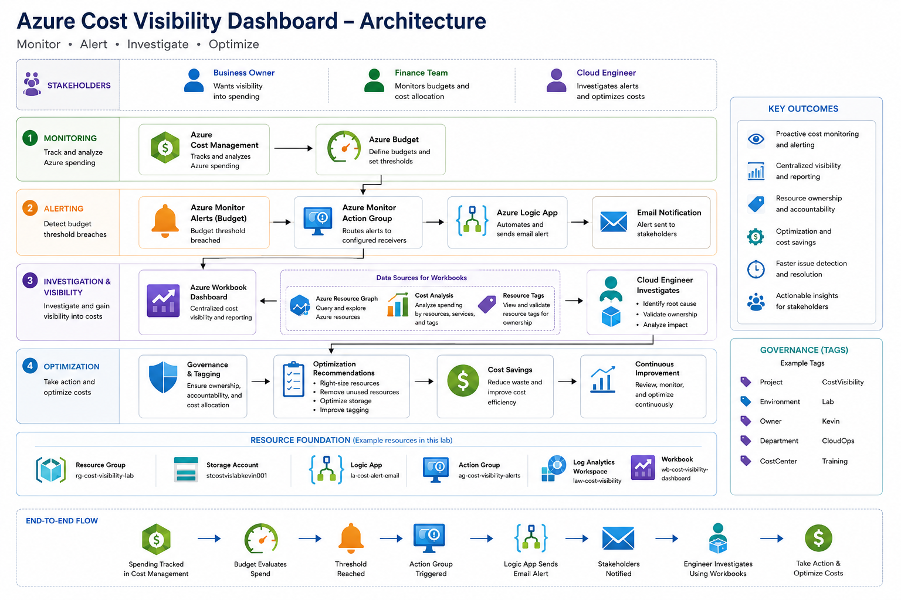
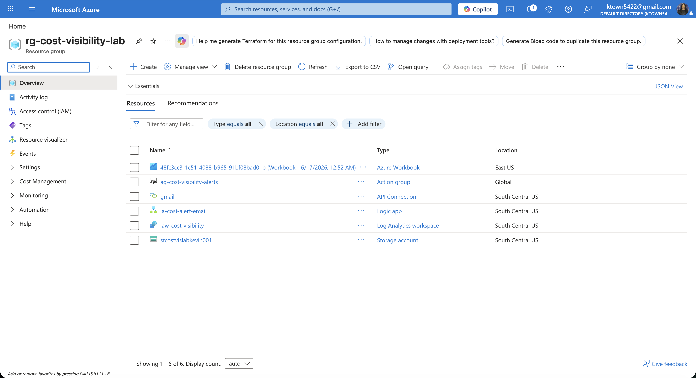
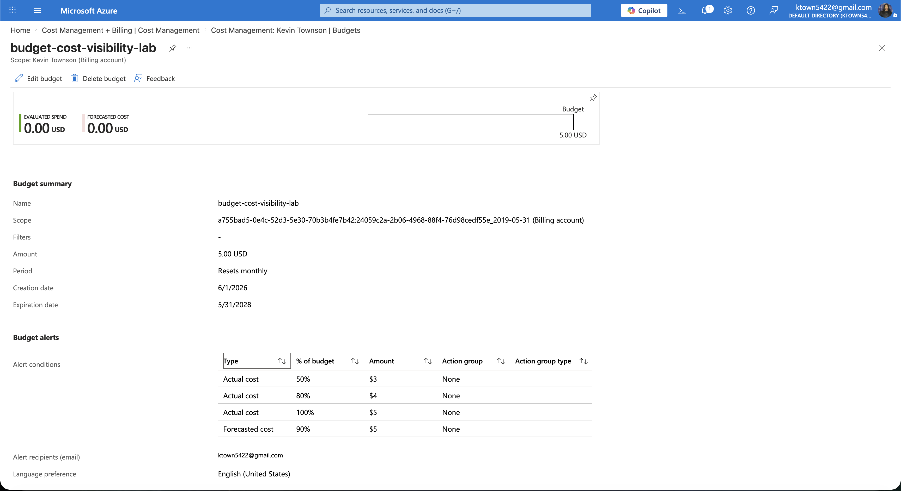

# Azure Cost Visibility Dashboard

A cloud engineering project that helps organizations monitor Azure spending, receive proactive budget alerts, investigate unexpected cost increases, and improve cost accountability through governance and automation.

---

## Business Problem

Organizations often struggle to understand, predict, and control cloud spending.

Cloud costs can increase unexpectedly when resources are over-provisioned, left running, improperly tagged, or deployed without governance controls. Without visibility into budgets, forecasts, and resource ownership, stakeholders may not discover cost issues until the monthly invoice arrives.

### Example Scenario

A team expects a monthly Azure spend of **$5,000**.

By the end of the month, the actual spend reaches **$30,000** due to:

- Unused resources remaining deployed
- Lack of budget monitoring
- Missing ownership tags
- No automated alerting
- Limited visibility into service-level costs

---

## Solution

The Azure Cost Visibility Dashboard provides proactive cost monitoring, governance, investigation, and optimization capabilities.

The solution uses:

- Azure Cost Management
- Azure Budgets
- Azure Monitor
- Azure Action Groups
- Azure Logic Apps
- Azure Workbooks
- Azure Resource Graph
- Governance Tags

### Key Capabilities

#### Cost Monitoring

- Track Azure spending trends
- Monitor actual versus forecasted costs
- Analyze costs by resource and service

#### Alerting

- Budget threshold monitoring
- Automated email notifications
- Early warning of potential cost overruns

#### Governance

- Resource ownership tracking
- Project and department tagging
- Cost center allocation

#### Investigation

- Centralized Workbook dashboard
- Resource inventory reporting
- Cost analysis workflow
- Cost investigation runbook

#### Optimization

- Identify unused resources
- Improve tagging compliance
- Recommend cost-saving actions

---

## Architecture

Additional Architecture Documentation:

- [Architecture Explanation](architecture/architecture-explanation.md)

---

# 🚀 Follow Along Lab Guide

Want to build this project yourself?

This repository includes a complete step-by-step implementation guide that walks through every phase of the project, including Azure resource creation, budget configuration, monitoring, automation, dashboards, governance, and troubleshooting.

## Start Here

📖 **Lab Guide**

👉 [View the Step-by-Step Lab Guide](docs/lab-guide.md)

### What You'll Build

- Resource Group
- Resource Tagging Strategy
- Storage Account
- Azure Budgets
- Azure Monitor Alerts
- Action Groups
- Logic Apps
- Log Analytics Workspace
- Azure Workbook Dashboard
- Azure Resource Graph Queries
- Cost Investigation Workflow

### Skills You'll Learn

- Azure Cost Management
- Azure Governance
- Azure Monitoring
- Azure Automation
- Azure Workbooks
- Azure Resource Graph
- Cloud Operations
- Cost Optimization

### Estimated Completion Time

**2–4 Hours**

### Skill Level

**Beginner → Intermediate Cloud Engineer**

---

## Project Documentation

### Problem and Solution

Explains the business problem, root causes, solution design, and business value.

📄 [Problem and Solution](docs/problem-solution.md)

### Architecture Explanation

Detailed explanation of the architecture and why each Azure service was selected.

📄 [Architecture Explanation](architecture/architecture-explanation.md)

### Cost Investigation Runbook

Operational process used when a budget alert is triggered.

📄 [Cost Investigation Runbook](docs/cost-investigation-runbook.md)

### Troubleshooting Log

Issues encountered and resolutions documented during implementation.

📄 [Troubleshooting Log](docs/troubleshooting-log.md)

### Lessons Learned

Technical, operational, and business lessons learned while building the project.

📄 [Lessons Learned](docs/lessons-learned.md)

---

## Azure Services Used

| Service | Purpose |
|----------|----------|
| Azure Cost Management | Monitor Azure spending |
| Azure Budgets | Define spending thresholds |
| Azure Monitor | Generate alerts |
| Azure Action Groups | Route notifications |
| Azure Logic Apps | Automate email alerts |
| Azure Workbooks | Cost visibility dashboard |
| Azure Resource Graph | Resource inventory and governance |
| Log Analytics Workspace | Monitoring foundation |
| Azure Storage Account | Generate cost data and resource activity |
| Resource Tags | Ownership and cost allocation |

---

## Screenshots

### Resource Group

### Budget Alerts

### Logic App Workflow

### Workbook Dashboard

### Email Notification

---

## Skills Demonstrated

### Cloud Engineering

- Azure Cost Management
- Azure Governance
- Cloud Operations
- Monitoring and Alerting
- Resource Management

### Automation

- Azure Logic Apps
- Action Groups
- Event-Driven Workflows

### Observability

- Azure Monitor
- Azure Workbooks
- Azure Resource Graph

### Documentation

- Architecture Design
- Runbooks
- Troubleshooting Guides
- Operational Documentation

---

## Future Improvements

Potential enhancements include:

- Azure Policy tag enforcement
- Power BI reporting integration
- Automated cost anomaly detection
- Multi-subscription reporting
- FinOps dashboards
- Azure Functions automation

---

## Business Outcome

This solution helps organizations:

- Detect cloud cost overruns earlier
- Improve visibility into Azure spending
- Identify resource ownership
- Increase accountability
- Reduce cloud waste
- Establish repeatable investigation procedures

By combining monitoring, automation, governance, and documentation, the Azure Cost Visibility Dashboard provides a practical example of how cloud engineers help organizations understand, control, and optimize cloud spending.